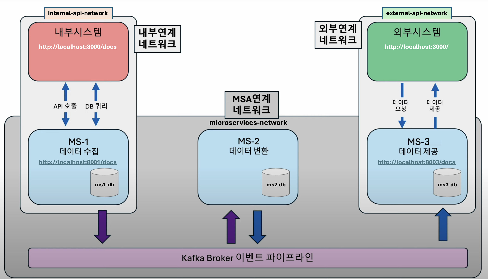
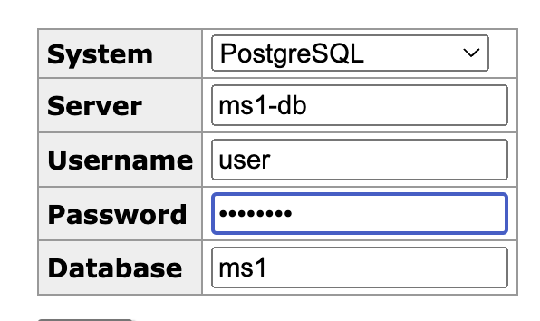
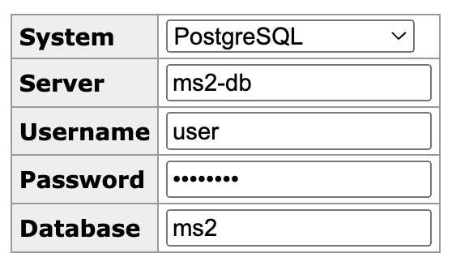
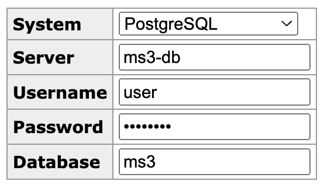

# MSA 프론트엔드

이 저장소는 MSA 프로젝트의 프론트엔드와 마이크로서비스 아키텍처를 포함하고 있습니다. 아래는 `docker-compose.yml` 파일에 정의된 서비스 및 구성에 대한 상세 설명입니다.

## 필수 조건

- Docker
- Docker Compose

## 사용법

서비스를 시작하려면 다음 명령어를 실행하세요:

```sh
docker-compose up --build
```

서비스를 중지하려면 다음 명령어를 실행하세요:

```sh
docker-compose down
```


## 컨테이너 구성도

[[YOUTUBE LINK] MS Architecture Overview](https://www.youtube.com/watch?v=H2tRLpL7qok)

더 자세한 내용은 아래의 이미지를 클릭하면 유튜브 설명 영상을 보실 수 있습니다.
[](https://www.youtube.com/watch?v=H2tRLpL7qok)

### 마이크로서비스 네트워크 구성요소
> ---
> #### Kafka 이벤트 파이프라인 - 마이크로서비스 간 소통 인프라
> - **이미지**: `bitnami/kafka:latest`
> - **네트워크**: `micrservices-network`
> ---
> #### MS1 - 데이터 수집 마이크로서비스
> - **MS1 API 접근주소**: http://localhost:8001/docs
> - **빌드**: `./ms1/`
> - **네트워크**: `micrservices-network`, `ms1-db_network`, `internal-api-network`
> - **의존 관계**: `kafka`
> - **환경 파일**: `./ms1/.env`
> ##### MS1-DB
> - 접근주소: http://localhost:8081
> - **이미지**: `postgres:latest`
> - **네트워크**: `ms1-db_network`
> - 
> ---
> #### MS2 - 데이터 분석/변환/통합 마이크로서비스
> - **빌드**: `./ms2/`
> - **네트워크**: `micrservices-network`, `ms2-db_network`
> - **의존 관계**: `kafka`
> - **환경 파일**: `./ms2/.env`
> 
> ##### MS2-DB
> - 접근주소: http://localhost:8082
> - **이미지**: `postgres:latest`
> - **네트워크**: `ms2-db_network`
> - 
> ---
> #### MS3 - 데이터 제공 API 마이크로서비스
> - **MS3 API 접근주소**: http://localhost:8003/docs
> - **빌드**: `./ms3/`
> - **네트워크**: `micrservices-network`, `ms3-db_network`, `external-api-network`
> - **의존 관계**: `kafka`
> - **환경 파일**: `./ms3/.env`
> ##### MS3-DB
> - 접근주소: http://localhost:8083
> - **이미지**: `postgres:latest`
> - **네트워크**: `ms3-db_network`
> - 
---


---
### 내부시스템 가상 API
- 접근주소: http://localhost:8000/docs

### 외부시스템 사용자 UI
- 접근주소: http://localhost:3000
---